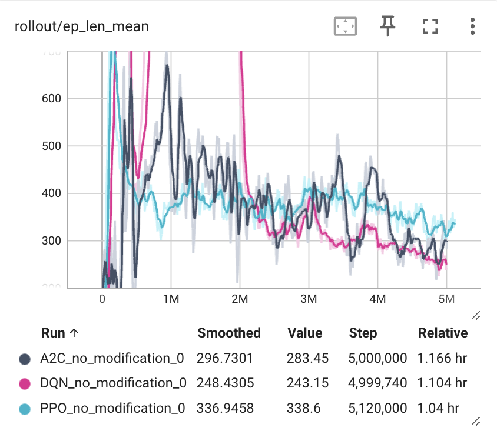
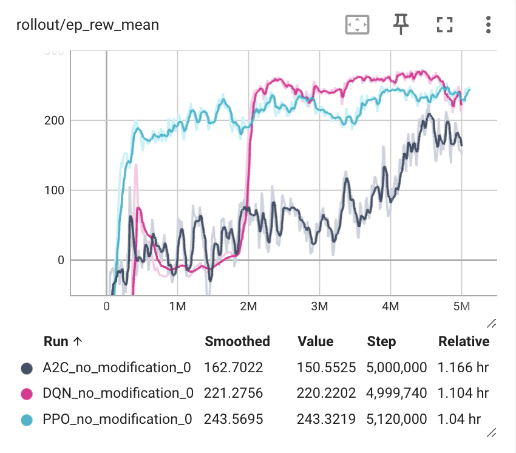
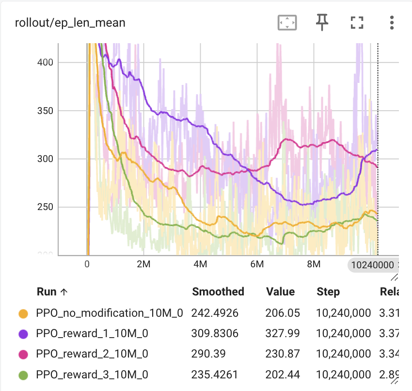
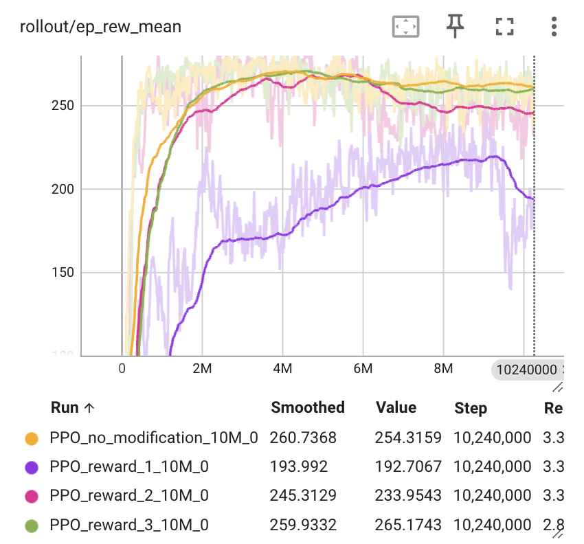
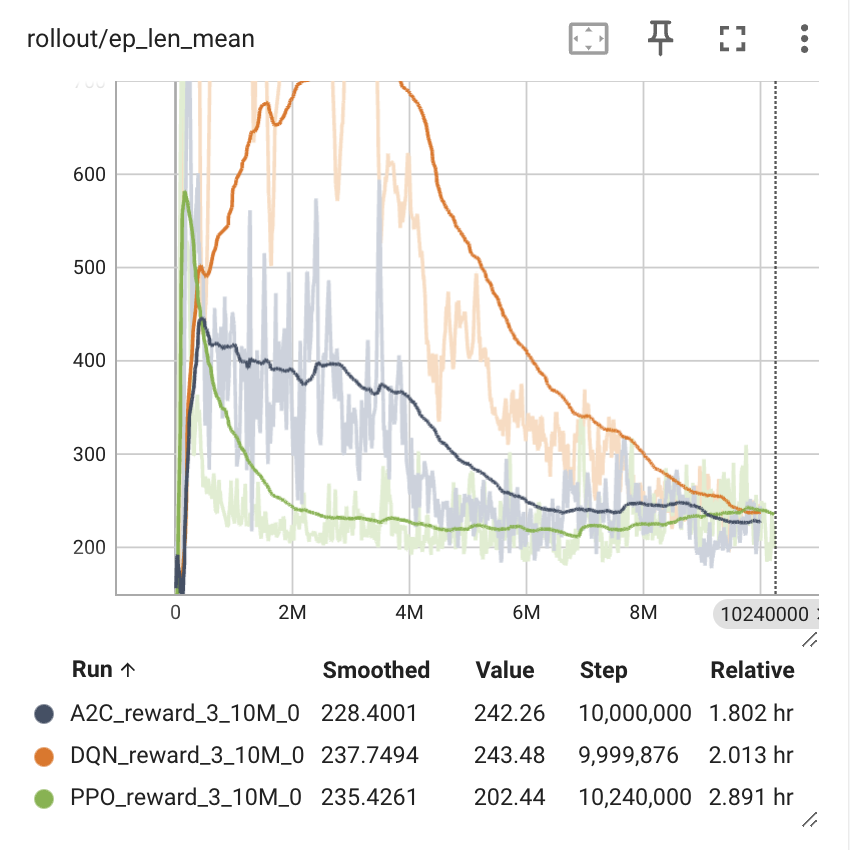
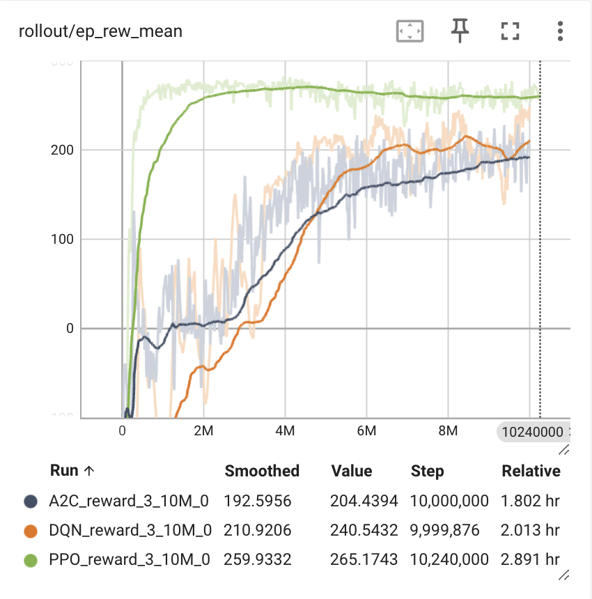
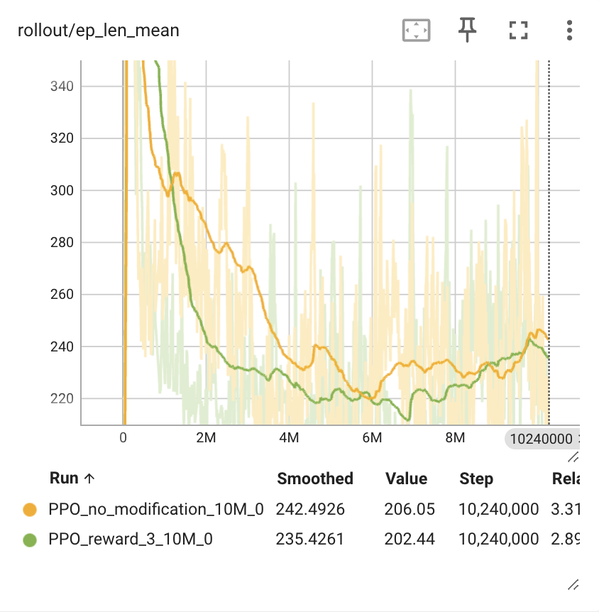
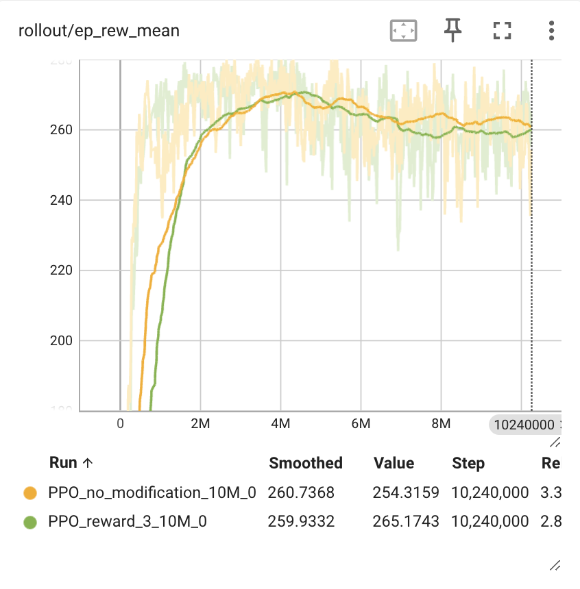
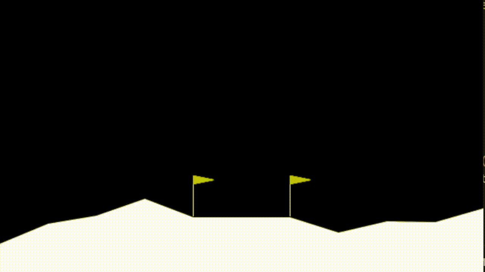
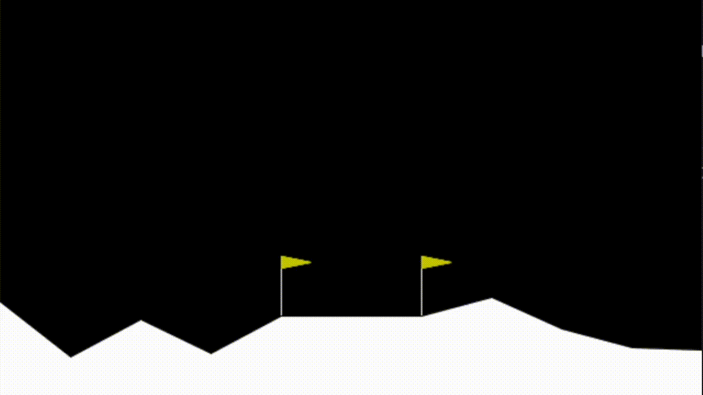

# Lunar Lander Reinforcement Learning
This project was developed by [Marisa Azevedo](https://github.com/marisaazevedo) and [Francisco Ribeiro](https://github.com/franciscoribeiro2003) for [Introduction to Intelligent Autonomous Systems (CC3042)](https://sigarra.up.pt/fcup/en/ucurr_geral.ficha_uc_view?pv_ocorrencia_id=529876) course at University of Porto. The main goal of this project is to train an agent to land a lunar lander in a landing zone, using reinforcement learning.
### Install dependecies

``` pip install -r requirements.txt ```

### Run

To run a trained model without changes, just run the following command:

``` python test_trained_model.py -o```

To run the original model, and the model with changes, run the following command:

``` python test_trained_model.py -c```

The other python files are used to train the models, except for the scricpts that are called reward1.py, reward2.py and reward3.py, which are the changes of the reward structure. The other names are self explanatory.

### Environment choosed

[Box 2D Lunar Lander Environment](https://gymnasium.farama.org/environments/box2d/lunar_lander/)

### Reinforcement learning algorithms

We decide to try three different algorithms: PPO, A2C and DQN.

Length                     |  Reward
:-------------------------:|:-------------------------:
     |  

For evaluating the algorithms we used the length of an episode and the reward of an episode. The lengh plot because we want the lander to land as fast as possible, and we used the reward plot in order to see and analyze the state and stability of a training.
And we notice, the *Proximal Policy Optimization* (PPO) algorithm was slightly better.
So we decide to train the agent with it using three different rewards structures created by us, that we felt that would make sense.

### Changes introduced to the reward structure
We did some changes to the reward structures based on the agent's observation space, which is composed by 8 values:

- **position x (0)**
        [-1.5 , 1.5]
- **position y (1)**
        [-1.5 , 1.5]
- **Linear velocity x (2)**
        [-5, 5]
- **Linear velocity y (3)**
        [-5, 5]
- **Angle (4)**
        [-3.1415927, 3.1415927] -> [-π, π]
- **Angle velocity (5)**
        [-5, 5]
- **Leg right (6)**
        0,1 -> false, true
- **Leg left (7)**
        0,1 -> false, true

#### Reward 1:

So the first reward structure would value the agent for being in the landing zone, for having the legs touching the ground and the velocity of the landing not being to rough neither the angle and the angular velocity is at desired values, meaning vertical align and not rotating. We also value the agent for being in the middle of the landing zone, we penalize the agent for not being in the landing zone, the agent will be receiving a reward or loosing points acording to the angle of the lander. The final penalty is, as long the lander is still in the air, it will be decrimenting points to make sure the agent will try to land as fast as possible.

```py
if done:
    if obs[0] > -0.1 and obs[0] < 0.1  and obs[3] > -0.5:
        reward += 10
        if obs[6] == 1 and obs[7] == 1:
            reward += 1.5

    elif obs[0] > -0.3 and obs[0] < 0.3 and obs[3] > -0.5 and abs(obs[4]) < 0.5 and abs(obs[5]) < 0.05:
        reward += 7
        if obs[6] == 1 and obs[7] == 1:
            reward += 1.5

    else:
        reward -= 10

    reward += (1 - abs(obs[4])) * 5

else:
    reward -= 0.2
```

#### Reward 2:

This reward structure is very similar to the previous one, the only difference is that we don't penalize the agent for being in the air, we only change the rewards when the episode is done.

```py
if done:
    if obs[0] > -0.1 and obs[0] < 0.1  and obs[3] > -0.5:
        reward += 10
        if obs[6] == 1 and obs[7] == 1:
            reward += 1.5

    elif obs[0] > -0.3 and obs[0] < 0.3 and obs[3] > -0.5 and abs(obs[4]) < 0.5 and abs(obs[5]) < 0.05:
        reward += 7
        if obs[6] == 1 and obs[7] == 1:
            reward += 1.5

    else:
        reward -= 10

    reward += (1 - abs(obs[4])) * 5
```

#### Reward 3:

This reward structure is very identical to the `reward 1`, the difference between them is that when the lander is in the air, the lander is penalized less than the `reward 1`.


```py
if done:
    if obs[0] > -0.1 and obs[0] < 0.1  and obs[3] > -0.5:
        reward += 10
        if obs[6] == 1 and obs[7] == 1:
            reward += 1.5

    elif obs[0] > -0.3 and obs[0] < 0.3 and obs[3] > -0.5 and abs(obs[4]) < 0.5 and abs(obs[5]) < 0.05:
        reward += 7
        if obs[6] == 1 and obs[7] == 1:
            reward += 1.5

    else:
        reward -= 10

    reward += (1 - abs(obs[4])) * 5

else:
    reward -= 0.1
```

### Comparing results

We compared the results of a 10 million time steps training for the three different rewards structures with the *Proximal Policy Optimization* (PPO) algorithm.* with no modifications, and we got the following results:

Length             |  Reward
:-------------------------:|:-------------------------:
  |  

As we can see, the `reward 3` was what performed better, not just was more fast, but also more stable, and the length plot shows that the episodes were more fast and consistent, and still kept slightly better than the reward with no modifications, which was the second best.
So we decided to train the agent with the `reward 3` for the others algorithms (A2C and DQN) too, so we would make sure that we had the hands down on the best traing possible, and we got the following results:

Length             |  Reward
:-------------------------:|:-------------------------:
  |  


The trained `reward 3` with PPO agent is still better than the others, so it will be the one we focus on.

### Final thoughts

Length             |  Reward
:-------------------------:|:-------------------------:
  |  

As seen in the plots above, we noticed that our model with changes, improved slightly compared to the model without changes. Since the length of an episode is mostly shorter and the rewards remains linear and constant, we judge that our changes were positive and improved the model. Here's a render of the best moment if each one of the models, just so we can see the difference besides the data:

| Without changes | With changes |
|:---:|:---:|
|||

In the samples that we collected, the model with changes performed the landings in the perfect center of the landing zone, while the model without changes sometimes landed at the border and sometimes one leg first touch the ground outside the pretended zone, so we can see that the changes we made were positive and improved the model.
